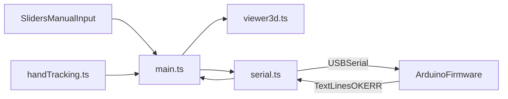

# Гайд по управлению роборукой в `digital-twin`

Этот документ описывает текущую реализацию управления роборукой в проекте: как устроены модули, как проходит сигнал от пользовательского ввода до отправки в Arduino, и как связана 3D-модель с сервоприводами.

## 1) Что это за система

Проект — веб-пульт управления 5-сервоприводной роборукой.  
В нём есть 4 ключевые части:

- `src/main.ts` — оркестратор UI, сборка пакета команд, связь между всеми подсистемами.
- `src/viewer3d.ts` — визуальный цифровой двойник (Three.js), который повторяет углы сервоприводов.
- `src/serial.ts` — транспорт Web Serial API для связи браузера с Arduino.
- `src/handTracking.ts` — модуль распознавания руки (MediaPipe), который преобразует положение кисти в углы S1..S5.

## 2) Архитектура и поток данных

Ключевая идея: `main.ts` хранит единый массив углов `values[]` (5 каналов), а все источники управления (слайдеры, hand tracking) обновляют именно его.  
После обновления:

1. Перерисовывается 3D-модель (`setServoAngle`).
2. Обновляется превью пакета (`A..B..C..D..E..;`).
3. При включенном `autoSend` и активном порте команда сразу уходит в Serial.

## 3) Карта сервоприводов и ограничений

В проекте используется конфигурация из 5 каналов (`SERVO_CONFIG` в `src/main.ts`):

| Канал | Буква в протоколе | Узел/сустав | Диапазон |
|---|---|---|---|
| S1 | A | База | 0..180 |
| S2 | B | Плечо | 0..180 |
| S3 | C | Локоть | 0..180 |
| S4 | D | Запястье | 0..180 |
| S5 | E | Захват | 35..90 |

Важно: диапазон `S5` уже ограничен в UI и в логике hand tracking. Для текущей механики захвата принято: `35` — открыт, `90` — закрыт, поэтому на стороне Arduino всё равно рекомендуется повторно делать `clamp` как защиту.

## 4) Как работает `main.ts` (центр управления)

### 4.1 Инициализация

При `DOMContentLoaded` вызывается `init()`, которое поднимает:

- слайдеры и live-значения;
- toggle авто-отправки;
- connect/disconnect/send для Serial;
- ручной ввод команд;
- лог мониторинга;
- мобильную навигацию;
- hand-tracking панель (если элементы присутствуют в DOM);
- 3D viewer (`initViewer3D`).

### 4.2 Ручное управление слайдерами

При событии `input` у слайдера:

1. Обновляется `values[index]`.
2. Обновляются числовое значение и визуальный трек.
3. Вызывается `setServoAngle(index, value)` для 3D-модели.
4. Пересобирается пакет (`buildPacket()`).
5. Если `autoSend=true` и есть соединение, вызывается `serial.send(packet)`.

### 4.3 Режим ручной отправки

Кнопка `Отправить` отправляет текущий пакет один раз.  
Поле ручного ввода позволяет отправить произвольную строку в порт (например, тестовую команду прошивки).

### 4.4 Логи и состояния

Все события идут в Serial Monitor:

- `tx` — отправленные пакеты;
- `rx` — входящие строки от Arduino;
- `sys` — состояния UI/процесса;
- `err` — ошибки транспорта и отправки.

## 5) Как работает `viewer3d.ts` (цифровой двойник)

Модуль загружает `roboarm.glb` и ищет узлы по именам:

- `base`
- `shoulder`
- `elbow`
- `wrist`
- `finger_l`
- `finger_r`

После этого цикл `animate()` постоянно вызывает `updateRobot()`, где значения целевых углов конвертируются в радианы и применяются к нужным осям:

- `base.rotation.y = degToRad(base)`
- `shoulder.rotation.x = degToRad(shoulder - 90)`
- `elbow.rotation.x = degToRad(elbow - 90)`
- `wrist.rotation.y = degToRad(wrist)`
- пальцы захвата расходятся симметрично через `rotation.z`: `35` визуально открыт, `90` визуально закрыт

Смещения `-90` на плече/локте — калибровка относительно нулевой позы экспортированной 3D-модели.

## 6) Как работает `serial.ts` (связь с Arduino)

### 6.1 Подключение

`connect(baudRate)`:

1. Проверяет поддержку `navigator.serial`.
2. Запрашивает порт у пользователя (`requestPort()`).
3. Открывает порт с выбранной скоростью.
4. Получает byte `reader`/`writer` из Web Serial API.
5. Запускает `readLoop()` и подписку на аппаратный `disconnect`.

### 6.2 Приём данных

`readLoop()` читает byte-поток, буферизует данные и режет текстовые строки по `\n`.  
Каждая непустая строка отправляется наружу через callback `onReceive(...)`.

Для OLED bitmap используется бинарный режим: строка `#OLED_BITMAP:1024\n` переключает парсер на чтение следующих 1024 байт как изображения 128×64.

### 6.3 Отправка данных

`send(data)` пишет строку в writer.  
На уровне `main.ts` обычно отправляется строка формата:

`A{angle}B{angle}C{angle}D{angle}E{angle};`

Пример: `A90B90C90D90E90;`.

### 6.4 Отключение

`disconnect()` безопасно:

- останавливает read loop;
- отменяет reader;
- закрывает writer;
- закрывает порт;
- очищает внутреннее состояние.

## 7) Как работает `handTracking.ts` (управление рукой)

Модуль использует `@mediapipe/hands` и 21 landmark кисти.

`calculateAngles()` маппит жесты в 5 углов:

- S1 (база): горизонтальная позиция запястья (`wrist.x`).
- S2 (плечо): вертикальная позиция запястья (`wrist.y`).
- S3 (локоть): степень сжатия кулака (средняя дистанция пальцев до запястья).
- S4 (запястье): наклон ладони (разница `indexMcp.y - pinkyMcp.y`).
- S5 (захват): pinch-дистанция `thumbTip <-> indexTip` в диапазон 35..90, где щипок дает около `90` (закрыт), разведенные пальцы — около `35` (открыт).

Для плавности применяется EMA-сглаживание, затем углы уходят в callback `onAnglesUpdate`.

### Важное текущее состояние сборки

Hand-tracking панель есть в DOM, но код MediaPipe загружается лениво только после нажатия `Запустить`. Это сохраняет основной bundle пульта легче и не влияет на ручное управление 3D-моделью.

## 8) Протокол Arduino: как должен быть устроен парсер

Ожидаемый контракт браузер ↔ Arduino:

- **TX:** строка с 5 каналами и завершающим `;`
- **RX:** текстовые строки статуса (`OK`, `ERR`, debug)

Рекомендованная минимальная логика прошивки:

1. Читать до `;`.
2. Извлекать значения каналов `A..E`.
3. Применять `clamp` диапазонов.
4. Записывать углы в соответствующие servo.
5. Возвращать короткий статус строкой.

## 9) Жизненный цикл управления (пошагово)

### Сценарий A: ручное управление

1. Пользователь подключает порт.
2. Двигает слайдеры S1..S5.
3. 3D-модель отражает изменения мгновенно.
4. Пользователь либо жмёт `Отправить`, либо включает `Авто-отправка`.
5. Пакеты уходят в Arduino, ответы приходят в монитор.

### Сценарий B: управление рукой (когда панель включена в DOM)

1. Пользователь запускает камеру.
2. MediaPipe на каждом кадре детектирует landmarks.
3. `handTracking.ts` считает углы S1..S5.
4. `main.ts` синхронизирует слайдеры, 3D и (при `autoSend`) serial-отправку.

## 10) Требования к 3D-модели для корректного управления

Для управляемой модели нужно:

- отдельные объекты для подвижных сегментов;
- корректная иерархия parent-child;
- origin каждого сегмента в оси шарнира;
- стабильные имена узлов, совпадающие с теми, что ищутся в `viewer3d.ts`.
- отдельный mesh `OLED_SCREEN`, если нужно выводить OLED preview на 3D-модель.

Если имя узла в модели отличается (например, `arm_base` вместо `base`), управление этим суставом в 3D не сработает, пока не обновить маппинг в коде.

## 11) Чеклист запуска

1. Установить зависимости: `npm install`.
2. Запустить dev-сервер: `npm run dev`.
3. Открыть в Chrome/Edge (нужен Web Serial API).
4. Подключить Arduino через `Подключить`.
5. Проверить, что статус стал `Подключено`.
6. Подвигать слайдеры и убедиться, что обновляется `Пакет данных`.
7. Отправить пакет и проверить `TX/RX` в мониторе.

## 12) Диагностика и типовые проблемы

### Web Serial не работает

- Симптом: кнопка подключения неактивна или ошибка поддержки.
- Причина: браузер без Web Serial.
- Решение: использовать Chromium-браузер (Chrome/Edge).

### Порт не выбирается

- Симптом: ошибка `Порт не выбран`.
- Причина: пользователь закрыл диалог `requestPort`.
- Решение: повторно нажать `Подключить` и выбрать устройство.

### Нет реакции роборуки при наличии TX

- Проверить baud rate в UI и прошивке (должны совпадать).
- Проверить, что прошивка читает до `;`.
- Проверить, что парсер ожидает формат `A..B..C..D..E..;`.

### 3D двигается, но физическая рука — нет

- Это означает, что контур UI/3D исправен, проблема вероятно в serial/прошивке/кабеле.
- Смотреть входящие `RX` и добавить диагностические `Serial.println` в прошивку.

### Hand tracking не запускается

- Проверить, что страница открыта с `https` или `localhost`.
- Проверить разрешение браузера на камеру.
- Проверить доступность MediaPipe assets из `@mediapipe/hands`.

## 13) Итог: как всё устроено в одном абзаце

Система построена по принципу «единый источник углов + два выхода»: `main.ts` собирает углы S1..S5 из пользовательского ввода (и потенциально hand tracking), мгновенно применяет их к цифровому двойнику в `viewer3d.ts` и формирует serial-пакет для `serial.ts`; дальше пакет передаётся в Arduino, а текстовые ответы возвращаются обратно в монитор. Это делает поведение предсказуемым: всё, что видно на слайдерах и в 3D, должно соответствовать отправленным командам в порт.

---

## 14) Список использованных источников

1. MDN Web Docs [Электронный ресурс]. – Web Serial API : справочник. – Режим доступа: https://developer.mozilla.org/en-US/docs/Web/API/Web_Serial_API (дата обращения: 08.04.2026).

2. MDN Web Docs [Электронный ресурс]. – input type="range" : справочник. – Режим доступа: https://developer.mozilla.org/en-US/docs/Web/HTML/Element/input/range (дата обращения: 08.04.2026).

3. Three.js Documentation [Электронный ресурс]. – Object3D : документация API. – Режим доступа: https://threejs.org/docs/#api/en/core/Object3D (дата обращения: 08.04.2026).

4. Three.js Documentation [Электронный ресурс]. – MathUtils : документация API. – Режим доступа: https://threejs.org/docs/#api/en/math/MathUtils (дата обращения: 08.04.2026).

5. Three.js Documentation [Электронный ресурс]. – GLTFLoader : документация API. – Режим доступа: https://threejs.org/docs/#examples/en/loaders/GLTFLoader (дата обращения: 08.04.2026).

6. Three.js Documentation [Электронный ресурс]. – OrbitControls : документация API. – Режим доступа: https://threejs.org/docs/#examples/en/controls/OrbitControls (дата обращения: 08.04.2026).
